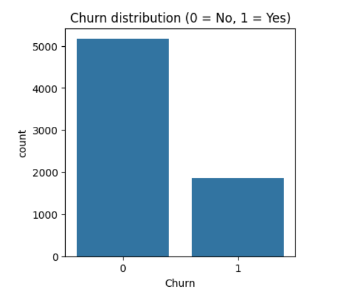
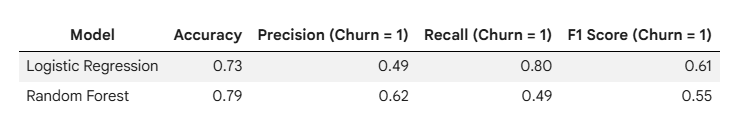
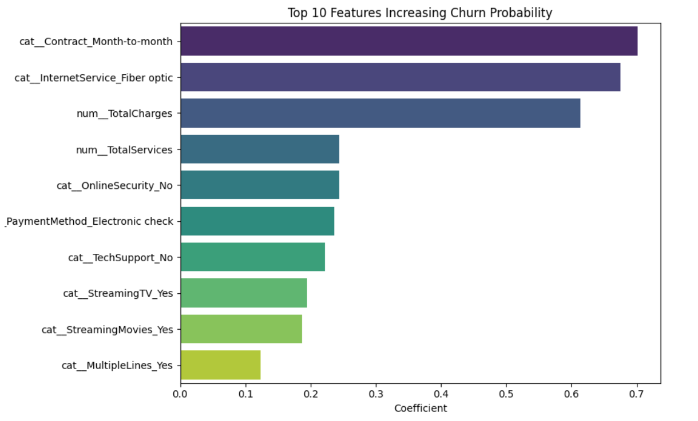

# Customer Churn Prediction Using Machine Learning

## Project Overview

Customer churn is a major challenge for subscription-based businesses. Retaining existing customers is often more cost-effective than acquiring new ones.

This project focuses on building a machine learning model to predict telecom customer churn using customer demographics, service usage, and billing information.

The goal is to identify high-risk customers and provide insights that can support customer retention strategies.

---

## Problem Statement

Develop a machine learning model that predicts whether a customer is likely to churn based on their characteristics and service usage patterns.

---

## Dataset

The project uses the Telco Customer Churn dataset containing information about:

- Customer demographics
- Account details
- Services subscribed
- Billing information
- Churn status

---

## Project Workflow

- Data understanding and exploration
- Data cleaning and preprocessing
- Exploratory Data Analysis (EDA)
- Feature engineering
- Model building
- Model evaluation
- Business insights

---

## Exploratory Data Analysis

### Churn Distribution

The dataset is moderately imbalanced, with approximately 26–27% of customers experiencing churn.

---

## Machine Learning Models

The following classification models were trained and compared:

- Logistic Regression
- Random Forest Classifier

Evaluation metrics used:

- Accuracy
- Precision
- Recall
- F1-score

### Model Comparison

---

## Feature Importance and Churn Drivers

Important factors influencing churn include:

- Month-to-month contracts
- Fiber optic internet service
- Lack of online security, backup, and tech support
- Electronic check payment method

---

## Business Insights

- Month-to-month customers are more likely to churn.
- Customers without support services show higher churn risk.
- Service bundles and retention offers can help improve customer loyalty.
- High-risk customers can be identified early for targeted retention campaigns.

---

## Business Recommendations

- Target month-to-month fiber optic customers with retention offers.
- Promote security, backup, and support service bundles.
- Monitor high-risk payment segments.
- Use churn prediction models for regular customer risk scoring.

---

## Conclusion

This project demonstrates how machine learning can be used to predict customer churn and generate actionable business insights. The developed model can help businesses identify customers at risk and support proactive retention strategies.

---

## Technologies Used

- Python
- Pandas
- NumPy
- Matplotlib
- Seaborn
- Scikit-learn
- Jupyter Notebook

